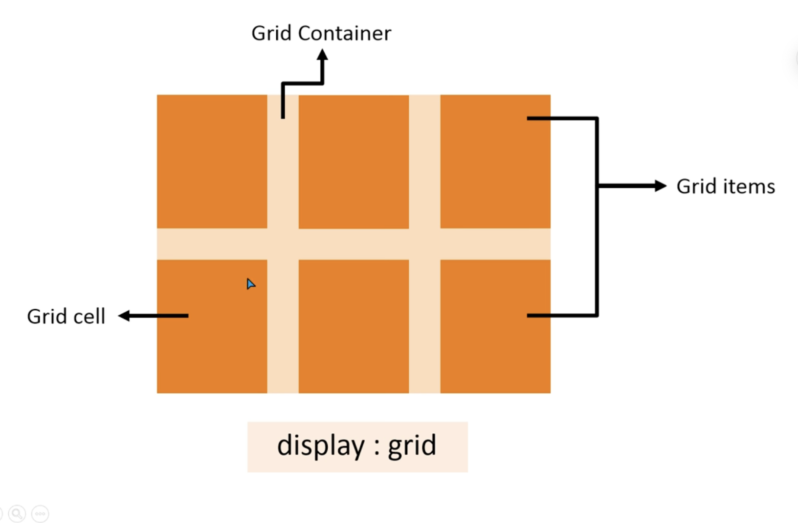

<html >
<head>
    <meta charset="UTF-8">
    <meta http-equiv="X-UA-Compatible" content="IE=edge">
    <meta name="viewport" content="width=device-width, initial-scale=1.0">
    <title>Document</title>
</head>
<body>

    <b> • Two dimensional grid system 
        • CSS Grid Layout replaces float layout 
        • Fast & Clean Code 
        • No need of CSS frameworks 
    </b>

     
    
    
</body>
</html>